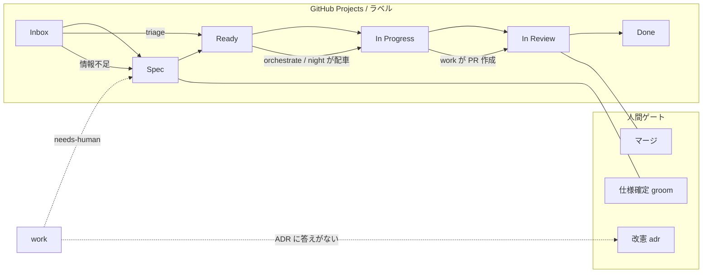

# factory

24 時間自律稼働する開発工場を組み立てるプラグイン。設計の全文と進捗は [naito-7110/claude-plugins#4](https://github.com/naito-7110/claude-plugins/issues/4) にある。

## 思想

1. **プロセスと規約の分離** — プラグインが持つのは「仕事の流れ方」だけ。「何が正しいコードか」は各プロジェクトの ADR が持つ。プラグインにスタック固有のコマンドは一切書かない
2. **ADR = 憲法、エージェントは司法** — エージェントは ADR を解釈・適用する。改憲は人間の承認ゲートを必ず通る。ADR に答えがない設計判断は「ADR 候補の発見」としてエスカレーションする
3. **人間 = 意思決定、エージェント = 実行** — 人間のゲートは 3 つだけ: 仕様の確定(groom)・改憲(adr)・マージ
4. **GitHub が唯一の耐久状態** — issue・ラベル・Projects・PR がすべての真実。通知も issue コメントで行う
5. **迷ったら止まる(fail-closed)** — 無人モードは保守的に。同一失敗 2 回でエスカレーション、推測で進まない

スタック差分は三層構造で吸収する:

- **ポータブル原則(共有憲法)**: スタック非依存の原則。プロジェクトを跨いで再利用する。技術選定は入れない
- **ローカル ADR**: プロジェクト固有の決定。技術選定(「frontend は Vue」の類)は理由・代替案つきでここに記録する(改訂は /factory:adr、人間承認必須)
- **スタック事実**: 決定ではなく**事実**(検証コマンド・ビルド手順)。リポジトリ自体(CI 設定・マニフェスト・Makefile)から導出して CLAUDE.md に記録。`/factory:init` が生成・更新する

ポータブル原則の実体は [`adr/`](./adr/README.md) に同梱する**プリセット ADR コーパス**(参照モデル)。対象リポジトリへはコピーせず、スキルが `${CLAUDE_PLUGIN_ROOT}/adr/` を直接読むため、**プラグインの更新 = 全プロジェクトへの改訂の配布**になる。ローカル ADR が frontmatter で `Overrides: <slug>` を宣言すると、そのプロジェクトでは該当プリセットよりローカルが優先される。

## スキル

| スキル | 状態 | 役割 |
| --- | --- | --- |
| `/factory:init` | ✅ | 工場の設置: ラベル・ボード・憲法(ADR 0000)・スタック事実・`.agents/` scaffold |
| `/factory:adr` | ✅ | 改憲手続き: ローカル ADR の新設・改訂・廃止・Overrides、プリセット候補の還流(人間承認必須) |
| `/factory:triage` | ✅ | Inbox 仕分け: agent-ok / needs-human / priority 付与(fail-closed) |
| `/factory:groom` | ✅ | 仕様揉み(対話専用): 確定済みの設計を issue へ書き戻し Ready 化。merge:agent 付与の唯一の場 |
| `/factory:work` | ✅ | 中核: 影響調査 → worktree → TDD 実装 → 検証 → 文書同期 → セルフレビュー → PR(merge:agent なら条件付きマージまで) |
| `/factory:orchestrate` | Phase 2 | PM: ボード読み → 並列配車 → 回収 |
| `/factory:night` | Phase 3 | 無人ピッカー: ガードレール → 1 件だけ work を無人実行 |
| `/factory:report` | Phase 3 | 朝のダイジェスト: 夜間の成果・エスカレーション・滞留を要約 |

## 運用ラベル

`/factory:init` が作成する。エージェント運用ラベルと種別ラベル(feat 等)は直交する。

| ラベル | 意味 |
| --- | --- |
| `agent-ok` | エージェントが自律着手してよい |
| `agent-wip` | エージェント作業中(ミューテックス) |
| `needs-human` | 人間の判断待ち。エージェントは触らない |
| `priority:high` / `priority:low` | 優先度 |
| `merge:agent` | マージ軸(着手軸と直交)。grooming で AI が merge-policy を基に提案し、人間が承認して Ready 化と同時に付与(無人セッションは付与不可)。付いていれば agent がマージまで実行、無ければ人間マージが既定 |
